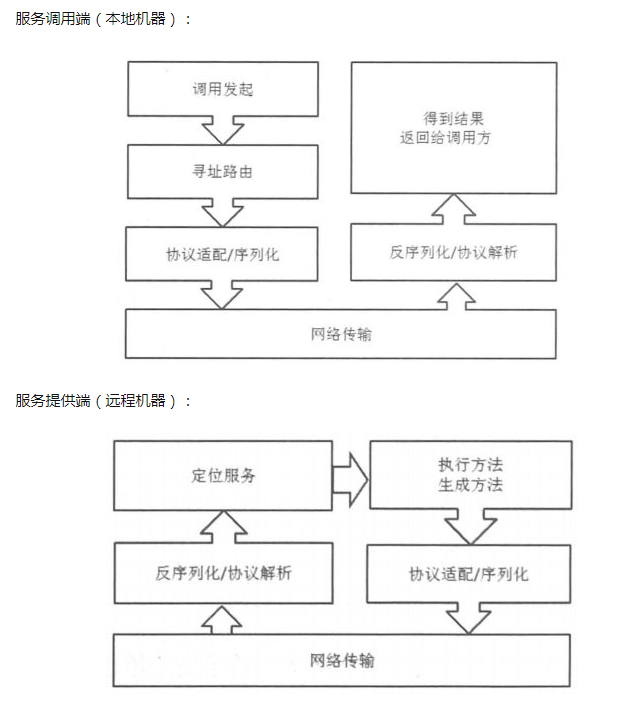

# node-rpc

使用nodejs实现的一个精简版的rpc框架

```js
// server
npm run server

// client
// run client by node client/run.js with process.argv
// node ./client/run ls
// 把你需要运行的参数放在运命命令的后面,示例中仅演示向服务器发送ls命令,并获取ls结果
npm run client
```

## 科普

RPC（Remote Procedure Call）远程过程调用，简单的理解是一个节点请求另一个节点提供的服务

rest api面向的是资源,而rpc面向的是服务

下面我找了两张图,帮助大家理解rpc  

[](rpc1.png)

[](rpc2.png)

## License

[MIT](LICENSE)
